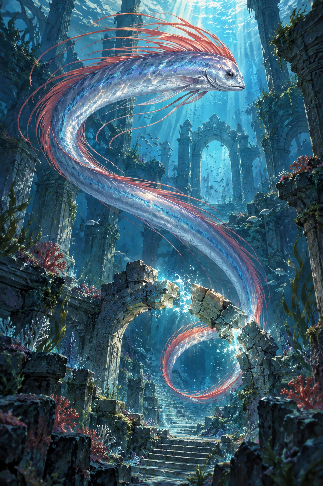
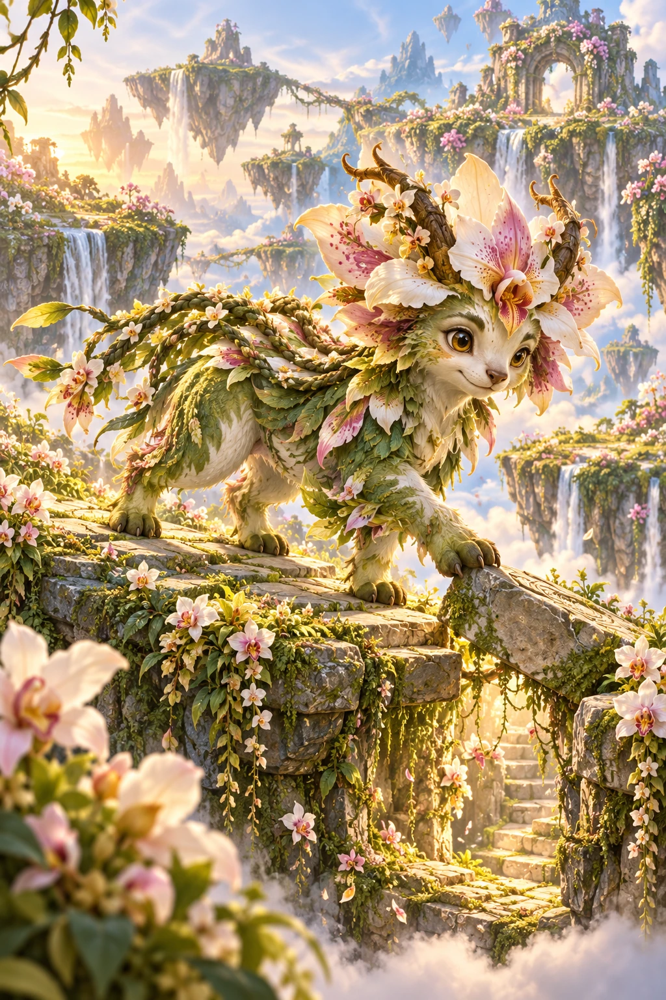
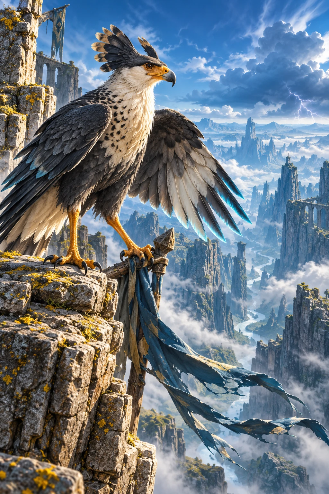
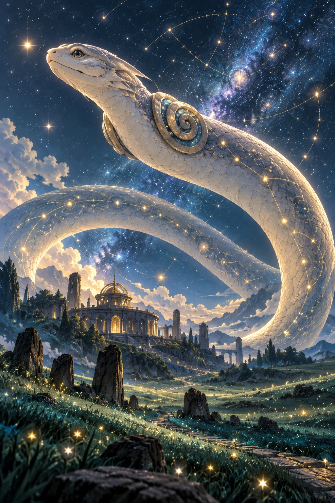
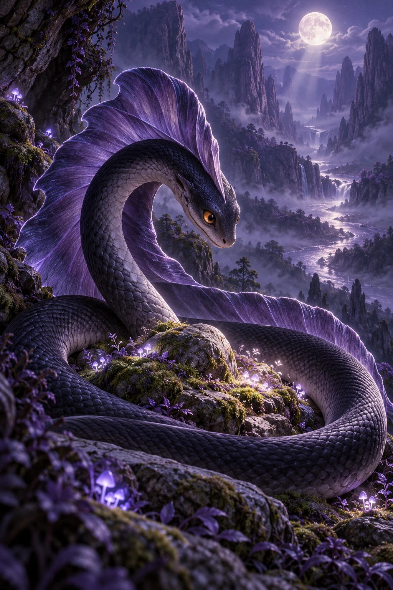
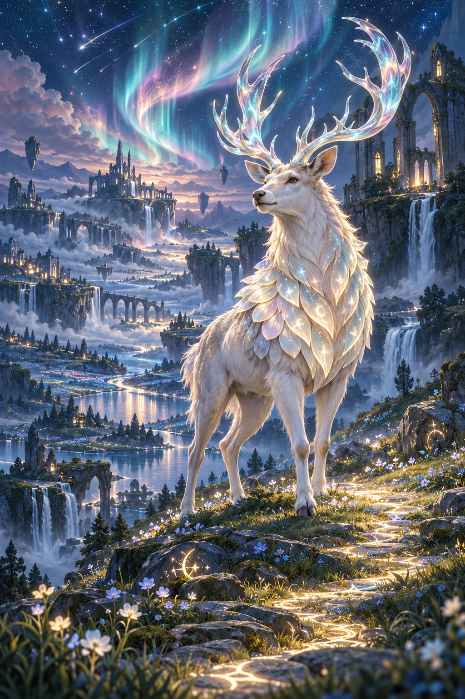

# Season One showcase — founder review packet

**2026-10-03 · six source-art studies · unreleased · not collectible · not pack-eligible.**

Canonical records have not been edited. Source art uses deterministic CardNest teal/gold composition: number and rarity above portrait, Theme left, class right, four canonical stats below. Avatars use smaller copies of the same art. Text and icons are rendered by code. All six retain the 190-point stat budget. Ability records are draft canon, not live gameplay.

No competitor artwork, character reference, brand logo or artist-style imitation was supplied. Initial inspection looked for obvious watermarks, silhouette defects and inappropriate content; it does not establish exclusive rights or legal clearance. Founder review remains pending.

| Rarity | Experience direction | Avoid |
|---|---|---|
| Common | Clear personality, readable habitat | Disposable filler |
| Rare | Habitat clues, emotional specificity | Gold as the only difference |
| Epic | Scale or intimate environmental storytelling | Repeated poses, particle clutter |
| Legendary | Optional habitat entry, quiet sky motion | Better battle stats, compulsory animation |

Each brief below calls for one individual 2:3 portrait: premium painterly original fantasy, family appropriate; no text, frame, logos, watermarks, franchise silhouettes, contact sheets or multiple alternate designs. Strong thumbnail silhouette and meaningful habitat. Briefs document the production direction; they are not a verbatim tool execution log.

## CN1-108 · Deepstream Oarfish

| Canonical field | Value |
|---|---|
| Stable ID | `reserved-108` |
| Theme / rarity / class | Tide / rare / Disruptor |
| Creature / personality / habitat | oarfish / watchful / Ocean Ruins |
| HP / ATK / DEF / SPD | 100 / 40 / 20 / 30 |
| Energy cost | 3 |
| Theme / class keys | wave / broken-ring |

**Canonical lore:** Deepstream Oarfish repairs a weather-worn sanctuary in Ocean Ruins. Its ring-shaped tail tip records each safe journey as a new luminous mark.

**Primary:** `{"name": "Crosswind Feint", "effect": "reduce_speed", "amount": 20, "target": "opponent", "energyCost": 1, "cooldownTurns": 2, "durationTurns": 1, "description": "Reduce speed 20 for opponent; one turn, two-turn cooldown."}`

**Secondary:** `{"name": "Nest Exchange", "effect": "transfer_guard", "amount": 10, "target": "ally", "energyCost": 1, "cooldownTurns": 2, "durationTurns": 1, "description": "Transfer guard 10 for ally; one turn, two-turn cooldown."}`

**Passive:** `null`

**Production composition brief:** A silver-blue ribbon-long oarfish curves through a deep ocean sanctuary. Its ring-shaped tail tip reaches a worn arch. Show a watchful face, soft shafts of sea light, teal ruins and distant fish for scale. The repair is the story. Keep the long body readable at thumbnail size.

**Treatment:** Rare depth comes from light, water and a story-rich setting.

**Visual check:** Initial silhouette, habitat, theme and family-appropriateness inspection completed; founder originality, rights and final-quality review pending. The two serpents use different scales, poses and palettes. No watermark was observed. Full source 1024×1536; avatar 400×600. Source SHA-256 `ea819f3a1a3ed69948faea0ad4bf3e29c34da4e0d7acbe06c384276d82c12986`.

**Founder checkpoint:** inspect full art, coded card frame, mobile name wrapping, icons, stats/abilities/lore, originality and rights. Approval of an illustration alone must not unlock release or pack eligibility. Layered animation and export-ready printed card files remain separate deliverables.

## CN1-168 · Orchidhelm Guardian

| Canonical field | Value |
|---|---|
| Stable ID | `reserved-168` |
| Theme / rarity / class | Bloom / rare / Support |
| Creature / personality / habitat | horned orchid guardian / playful / Floating Meadows |
| HP / ATK / DEF / SPD | 110 / 20 / 30 / 30 |
| Energy cost | 3 |
| Theme / class keys | leaf / heart-spark |

**Canonical lore:** Orchidhelm Guardian maps a forgotten passage in Floating Meadows. Its braided back filaments records each safe journey as a new luminous mark.

**Primary:** `{"name": "Nest Renewal", "effect": "heal", "amount": 20, "target": "ally", "energyCost": 1, "cooldownTurns": 2, "durationTurns": 1, "description": "Heal 20 for ally; one turn, two-turn cooldown."}`

**Secondary:** `{"name": "Nest Exchange", "effect": "transfer_guard", "amount": 10, "target": "ally", "energyCost": 1, "cooldownTurns": 2, "durationTurns": 1, "description": "Transfer guard 10 for ally; one turn, two-turn cooldown."}`

**Passive:** `null`

**Production composition brief:** A playful four-legged horned orchid guardian explores floating meadow stepping stones. Orchid horns, braided back filaments, warm pink flowers and pearl-green fur distinguish the silhouette. A loose stone suggests a forgotten passage. Friendly curiosity, sunlight and distant hanging meadows; no aggressive armor.

**Treatment:** Rare appeal comes from character warmth and living detail.

**Visual check:** Initial silhouette, habitat, theme and family-appropriateness inspection completed; founder originality, rights and final-quality review pending. The two serpents use different scales, poses and palettes. No watermark was observed. Full source 1024×1536; avatar 400×600. Source SHA-256 `17aa9da74946f9220eb94bd1898bb5ee2fdb024488b9dcab99ebc159c8effb45`.

**Founder checkpoint:** inspect full art, coded card frame, mobile name wrapping, icons, stats/abilities/lore, originality and rights. Approval of an illustration alone must not unlock release or pack eligibility. Layered animation and export-ready printed card files remain separate deliverables.

## CN1-229 · Roadwarden Caracara

| Canonical field | Value |
|---|---|
| Stable ID | `reserved-229` |
| Theme / rarity / class | Volt / rare / Disruptor |
| Creature / personality / habitat | caracara / watchful / Wind Canyons |
| HP / ATK / DEF / SPD | 100 / 40 / 20 / 30 |
| Energy cost | 3 |
| Theme / class keys | storm-swirl / broken-ring |

**Canonical lore:** Roadwarden Caracara repairs a weather-worn sanctuary in Wind Canyons. Its split fan crest records each safe journey as a new luminous mark.

**Primary:** `{"name": "Crosswind Feint", "effect": "reduce_speed", "amount": 20, "target": "opponent", "energyCost": 1, "cooldownTurns": 2, "durationTurns": 1, "description": "Reduce speed 20 for opponent; one turn, two-turn cooldown."}`

**Secondary:** `{"name": "Nest Exchange", "effect": "transfer_guard", "amount": 10, "target": "ally", "energyCost": 1, "cooldownTurns": 2, "durationTurns": 1, "description": "Transfer guard 10 for ally; one turn, two-turn cooldown."}`

**Passive:** `null`

**Production composition brief:** A watchful graphite-and-cream caracara with split fan crest steadies a wind-worn sanctuary pennant on a canyon ledge. Two legs and two wings. Cyan-tipped feathers, immense air and weathered paths convey Volt. Electricity belongs to distant weather rather than a generic lightning-bird body.

**Treatment:** Rare motion lives in the habitat; distant electricity stays subtle.

**Visual check:** Initial silhouette, habitat, theme and family-appropriateness inspection completed; founder originality, rights and final-quality review pending. The two serpents use different scales, poses and palettes. No watermark was observed. Full source 1024×1536; avatar 400×600. Source SHA-256 `89e42bdf3fd9168f0e74e370dc663e4a3eaa054dc3799dc94c0af602d5baae47`.

**Founder checkpoint:** inspect full art, coded card frame, mobile name wrapping, icons, stats/abilities/lore, originality and rights. Approval of an illustration alone must not unlock release or pack eligibility. Layered animation and export-ready printed card files remain separate deliverables.

## CN1-299 · Constellation Keeper Serpent

| Canonical field | Value |
|---|---|
| Stable ID | `reserved-299` |
| Theme / rarity / class | Mystic / epic / Disruptor |
| Creature / personality / habitat | constellation serpent / inquisitive / Starfall Fields |
| HP / ATK / DEF / SPD | 100 / 40 / 20 / 30 |
| Energy cost | 3 |
| Theme / class keys | celestial-star / broken-ring |

**Canonical lore:** Constellation Keeper Serpent shelters young companions in Starfall Fields. Its spiraled shoulder plates records each safe journey as a new luminous mark.

**Primary:** `{"name": "Crosswind Feint", "effect": "reduce_speed", "amount": 20, "target": "opponent", "energyCost": 1, "cooldownTurns": 2, "durationTurns": 1, "description": "Reduce speed 20 for opponent; one turn, two-turn cooldown."}`

**Secondary:** `{"name": "Nest Exchange", "effect": "transfer_guard", "amount": 10, "target": "ally", "energyCost": 1, "cooldownTurns": 2, "durationTurns": 1, "description": "Transfer guard 10 for ally; one turn, two-turn cooldown."}`

**Passive:** `{"name": "Patient Watch", "effect": "gain_guard_if_last", "amount": 5, "limitPerBattle": 1, "description": "Once per battle, gain 5 guard when acting last."}`

**Production composition brief:** An ancient ivory constellation serpent arches above a sanctuary observatory in Starfall Fields. Spiraled shoulder plates, a continuous sweeping body and tiny architecture establish scale. A celestial arch connects stars and safe paths. Avoid repeating the low-coiled Shadow pose.

**Treatment:** Epic scale and a sweeping body line make the world feel ancient.

**Visual check:** Initial silhouette, habitat, theme and family-appropriateness inspection completed; founder originality, rights and final-quality review pending. The two serpents use different scales, poses and palettes. No watermark was observed. Full source 1024×1536; avatar 400×600. Source SHA-256 `3bd046893745dd1ffb932c3431c684c978192c2548d4a5128837d9c7c9d22f26`.

**Founder checkpoint:** inspect full art, coded card frame, mobile name wrapping, icons, stats/abilities/lore, originality and rights. Approval of an illustration alone must not unlock release or pack eligibility. Layered animation and export-ready printed card files remain separate deliverables.

## CN1-359 · Velvet Coil Serpent

| Canonical field | Value |
|---|---|
| Stable ID | `reserved-359` |
| Theme / rarity / class | Shadow / epic / Disruptor |
| Creature / personality / habitat | velvet serpent / inquisitive / Shadow Valleys |
| HP / ATK / DEF / SPD | 100 / 40 / 20 / 30 |
| Energy cost | 3 |
| Theme / class keys | moon-glow / broken-ring |

**Canonical lore:** Velvet Coil Serpent shelters young companions in Shadow Valleys. Its arched dorsal sail records each safe journey as a new luminous mark.

**Primary:** `{"name": "Crosswind Feint", "effect": "reduce_speed", "amount": 20, "target": "opponent", "energyCost": 1, "cooldownTurns": 2, "durationTurns": 1, "description": "Reduce speed 20 for opponent; one turn, two-turn cooldown."}`

**Secondary:** `{"name": "Nest Exchange", "effect": "transfer_guard", "amount": 10, "target": "ally", "energyCost": 1, "cooldownTurns": 2, "durationTurns": 1, "description": "Transfer guard 10 for ally; one turn, two-turn cooldown."}`

**Passive:** `{"name": "Patient Watch", "effect": "gain_guard_if_last", "amount": 5, "limitPerBattle": 1, "description": "Once per battle, gain 5 guard when acting last."}`

**Production composition brief:** A soft dark velvet serpent rests in a low sheltering coil in Shadow Valleys. Show the arched dorsal sail, gentle eyes, moonlit moss and a quiet sanctuary path. Tactile velvet and indigo light create intimacy. No fangs, gore, horror or predatory lunging.

**Treatment:** Epic intimacy and tactile shadow contrast with the celestial giant.

**Visual check:** Initial silhouette, habitat, theme and family-appropriateness inspection completed; founder originality, rights and final-quality review pending. The two serpents use different scales, poses and palettes. No watermark was observed. Full source 1024×1536; avatar 400×600. Source SHA-256 `09e247c34eecb136bee2f3b8a8cd4e7e2c83689fe36fc6f71e45bc4e94be5d05`.

**Founder checkpoint:** inspect full art, coded card frame, mobile name wrapping, icons, stats/abilities/lore, originality and rights. Approval of an illustration alone must not unlock release or pack eligibility. Layered animation and export-ready printed card files remain separate deliverables.

## CN1-307 · Aurora Herald

| Canonical field | Value |
|---|---|
| Stable ID | `reserved-307` |
| Theme / rarity / class | Mystic / legendary / Warden |
| Creature / personality / habitat | aurora stag / sociable / Starfall Fields |
| HP / ATK / DEF / SPD | 110 / 20 / 50 / 10 |
| Energy cost | 3 |
| Theme / class keys | celestial-star / guardian-shield |

**Canonical lore:** Aurora Herald repairs a weather-worn sanctuary in Starfall Fields. Its broad shield collar records each safe journey as a new luminous mark.

**Primary:** `{"name": "Shelter Oath", "effect": "gain_guard", "amount": 20, "target": "ally", "energyCost": 1, "cooldownTurns": 2, "durationTurns": 1, "description": "Gain guard 20 for ally; one turn, two-turn cooldown."}`

**Secondary:** `{"name": "Nest Exchange", "effect": "transfer_guard", "amount": 10, "target": "ally", "energyCost": 1, "cooldownTurns": 2, "durationTurns": 1, "description": "Transfer guard 10 for ally; one turn, two-turn cooldown."}`

**Passive:** `{"name": "Patient Watch", "effect": "gain_guard_if_last", "amount": 5, "limitPerBattle": 1, "description": "Once per battle, gain 5 guard when acting last."}`

**Production composition brief:** An ivory aurora stag with four readable legs and a broad pearl shield collar stands beside a glowing repaired sanctuary path. Aurora-lit branching antlers, teal terraces and an open sky express sociable guardianship. The collar records luminous safe-journey marks. Leave sky room for gentle motion; no bird anatomy.

**Treatment:** Legendary treatment adds an optional habitat-view prototype; no stat increase.

**Visual check:** Initial silhouette, habitat, theme and family-appropriateness inspection completed; founder originality, rights and final-quality review pending. The two serpents use different scales, poses and palettes. No watermark was observed. Full source 1024×1536; avatar 400×600. Source SHA-256 `99e353fd2543d45d2ca73f019c37c7f1058a09a8db606e188a5f6c2bed4e28be`.

**Founder checkpoint:** inspect full art, coded card frame, mobile name wrapping, icons, stats/abilities/lore, originality and rights. Approval of an illustration alone must not unlock release or pack eligibility. Layered animation and export-ready printed card files remain separate deliverables.

